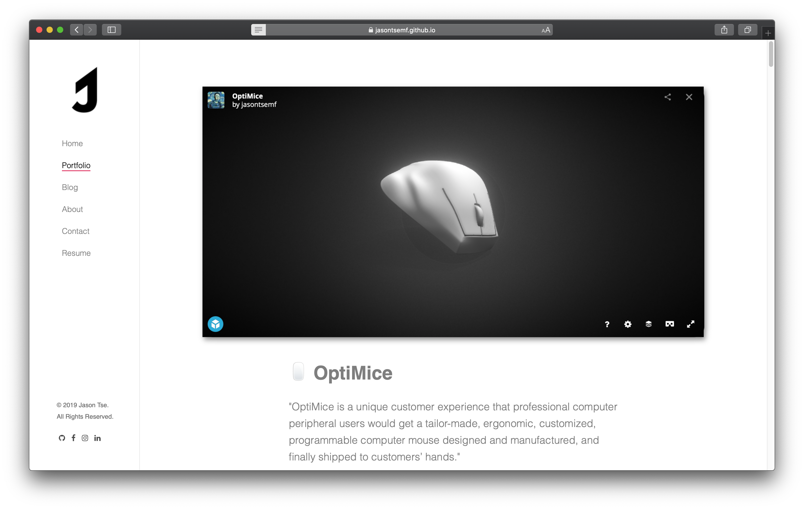
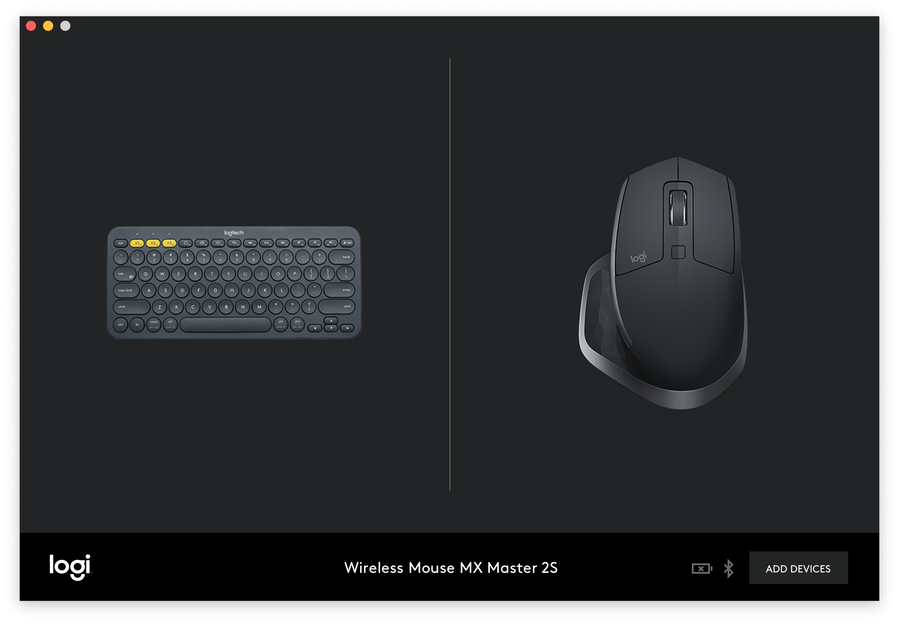
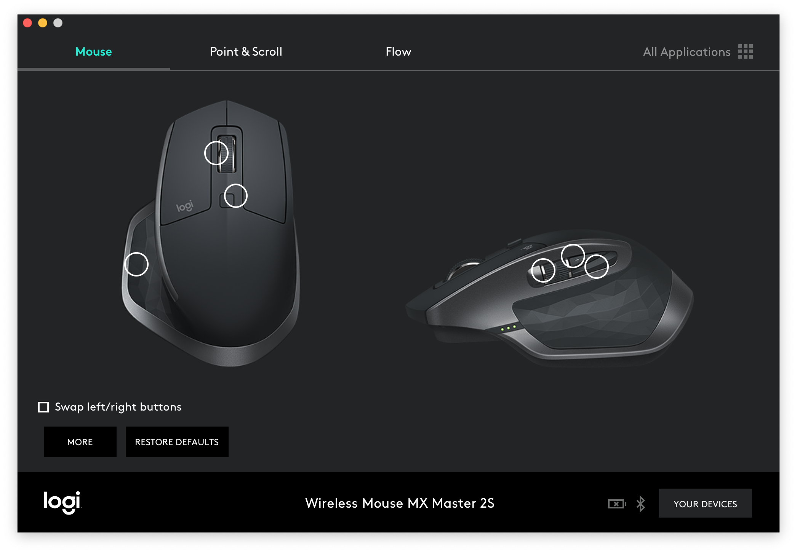
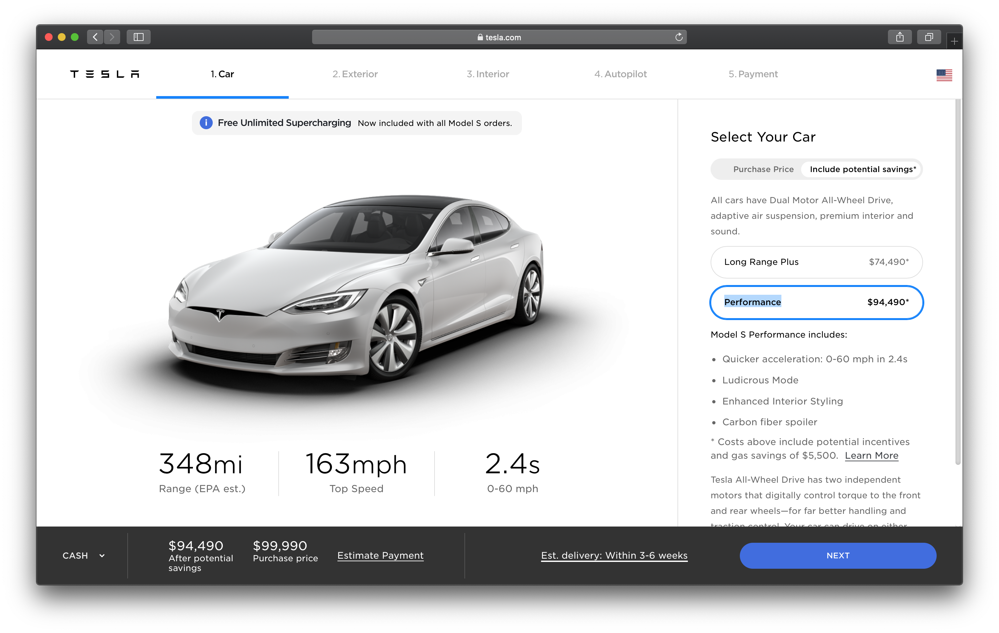
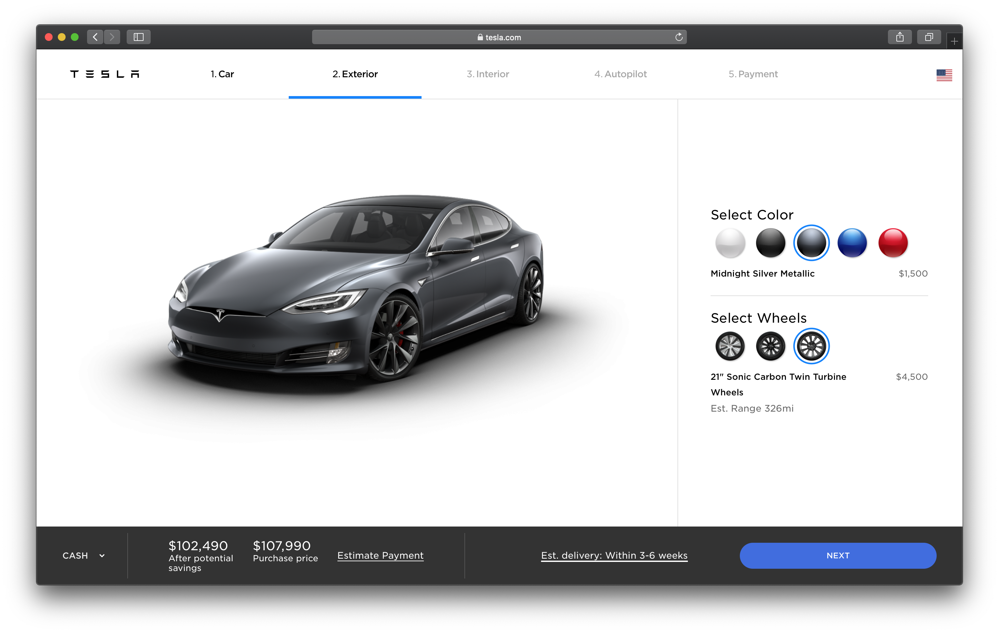
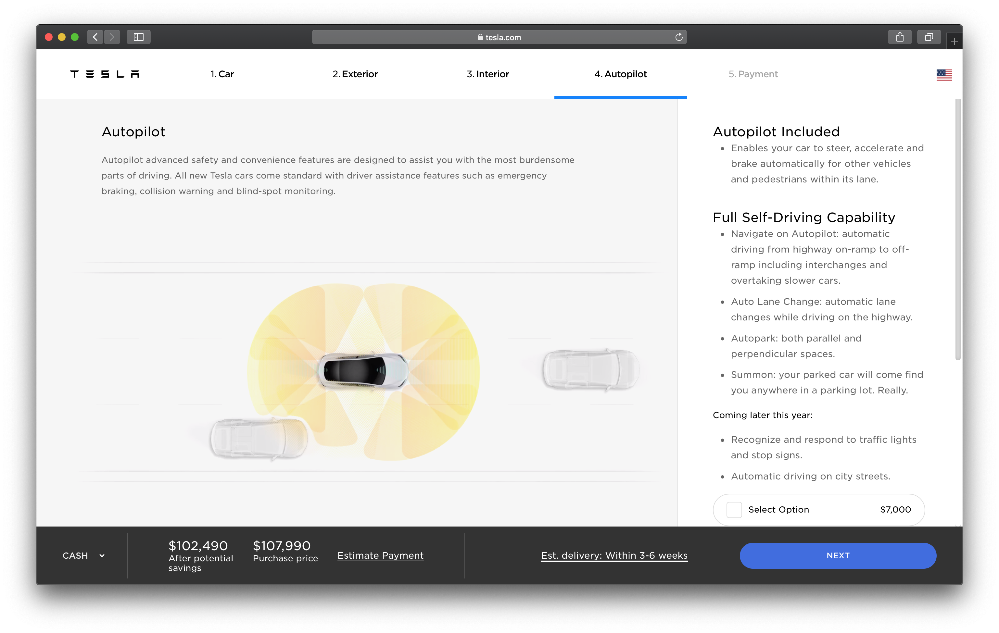
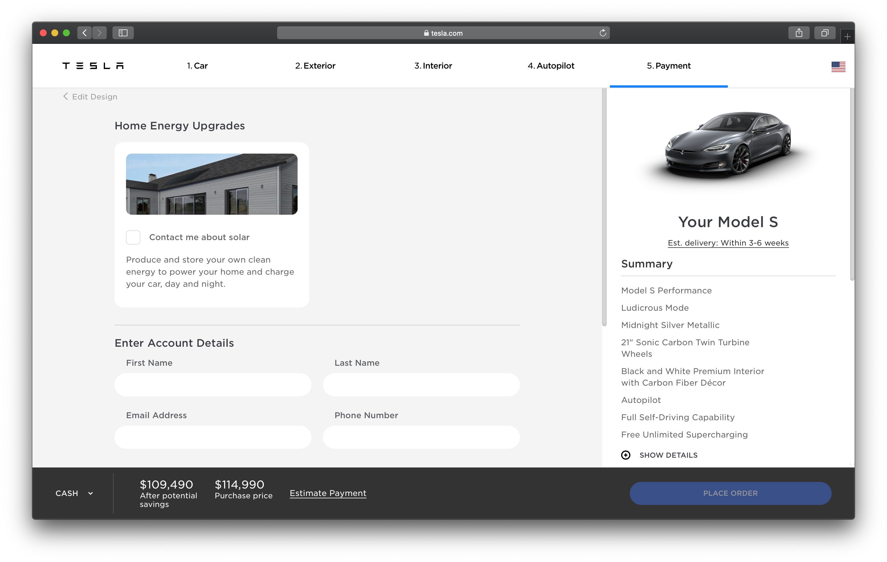
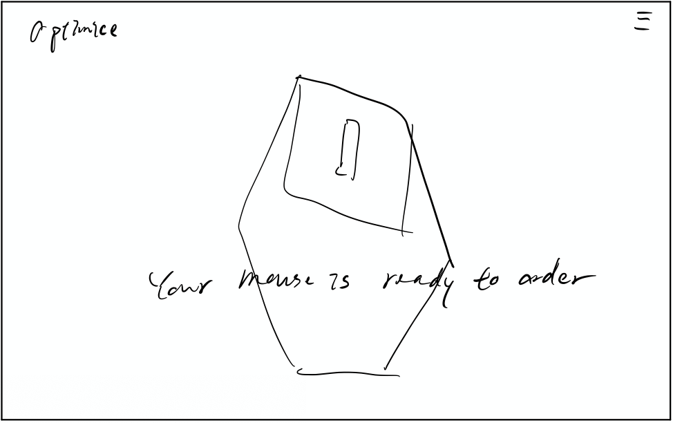
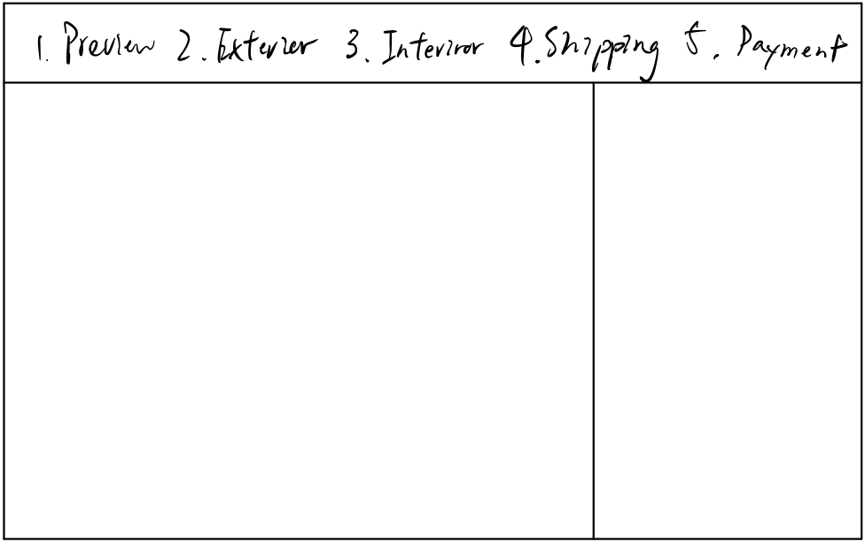
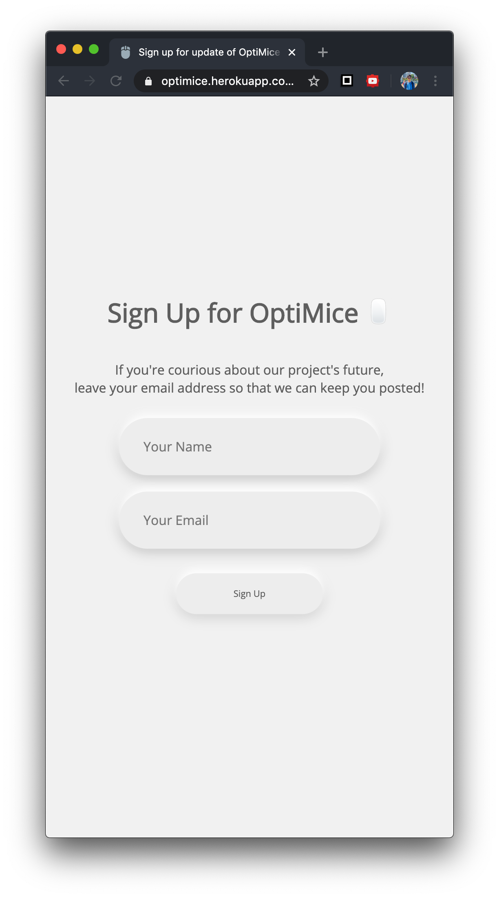

# OptiMice Web Platform



[OptMice Web Platform on Heroku](https://optimice.herokuapp.com/)

## Intro

This project __OptimiceDashboard__ is again a complementary project of my physical project [OptiMice](https://jasontsemf.github.io/optimice.html) that was first exhibited at the 2019 ITP Winter Show. The ultimate deliverable of this project is to develop a business, which includes a __web platform__ that allows users to

1. Upload images for photogrammetry analysis

2. View the post-analysis 3D model

3. Configure and make orders

4. Post-order hardware configurating software

That said, I have to finish them eventually no matter what. I have to try my best to finish/prototype at least one of the above four, ideally 2 (maybe).

## Project Proposal

### Expectation

Here are some of the technical elements that I want to include

- User Profile: frontend and table on `MongoDB`

- Order: frontend and table on `MongoDB`

- Using three.js to show a 3D interpretation of a mouse model

### Reference









## Project Development

### Completed Task

I took Cassie's advice into consideration, and adjusted my expectation by a little.

- Establish a general site flow and information architecture

- Order: frontend and table on `MongoDB`

- Using three.js to show a 3D interpretation of a mouse model
  
### Web Design

I decided to establish 6 pages in total

1. landing
2. login
3. signup
4. login-landing/dashboard
5. order
   1. preview
   2. exterior
   3. interior
   4. shipping
   5. payment
6. confirm

#### Wireframe





#### Mockup

[Project on Figma](https://www.figma.com/file/B7v9FoAAIiuAXctt3scEK8/OptiMice)

### Front End Development

Most of the front end components are being brought from some previous project to this final project, including

- [Neumorphism](https://github.com/jasontsemf/Neumorphism)
  - soft style HTML element and CSS
- [Populate](https://github.com/jasontsemf/Populate)
  - Input field, getting reading and style
- [OptimiceSignupMongo](https://github.com/jasontsemf/OptimiceSignupMongo)
  - A Holistic framework of the front end

However, the bugs that I didn't solve are removed when they are carried forward to this project


There is a new GitHub icon that brings the user to the original hardware project repository, which uses the font-awesome library.

``` HTML
<link rel="stylesheet" href="fa/css/all.css">
<i class="fab fa-github top-right"></i>
```

``` CSS
.top-right {
    position: absolute;
    top: 0%;
    right: 0%;
    margin-top: 10px;
    margin-right: 10px;
    font-size: 30px;
}
```

And I heavily depend on `margin-left: auto` and `margin-right: auto` to center elements on the screen.

``` CSS
.landing-mouse {
    width: 30%;
    height: 100%;
    margin-left: auto;
    margin-right: auto;
}
```



The input field on the signup page is now fixed with `@media` CSS query. So that the input field would not become too narrow on a phone screen.

``` CSS
.landing-mouse {
    width: 30%;
    height: 100%;
    margin-left: auto;
    margin-right: auto;
}

@media only screen and (max-width: 600px) {
    .landing-mouse {
        width: 70%;
        height: 100%;
        margin-left: auto;
        margin-right: auto;
    }
}
```
